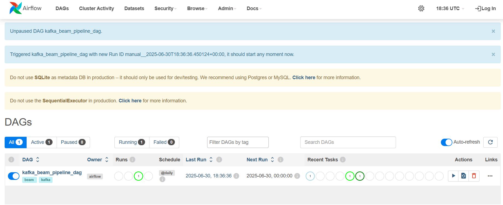
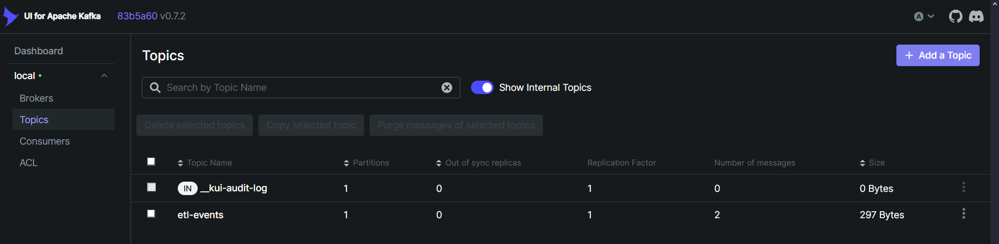

# Tarea 3 – ETL con Apache Beam, Kafka y Airflow

Este proyecto implementa un pipeline ETL que procesa datos desde un archivo JSON, los transforma y carga en un sistema de procesamiento basado en Apache Kafka y Apache Airflow.

## 📌 Descripción general

- El archivo de entrada se encuentra en: `./data/input/fan_engagement.json`
- El pipeline realiza:
  - **Extracción** de datos desde el archivo JSON.
  - **Transformación** a formato `.avro` usando un esquema definido.
  - **Carga** de una notificación al tópico `etl-events` en Kafka.
- Apache Airflow luego **consume los mensajes desde Kafka** para su monitoreo o procesamiento adicional.

---

## 🚀 Instrucciones de ejecución

### 1. Levantar el entorno con Docker

Si estás trabajando en un entorno DevContainer (como VSCode), asegúrate de abrir el entorno con:

```
Reopen in Container
```

O ejecutar:

```bash
docker compose up --build
```

---

### 2. Ejecutar Airflow

Una vez dentro del contenedor:

```bash
airflow standalone
```

Esto iniciará el webserver, scheduler y creará un usuario admin.

---

### 3. Ejecutar el pipeline ETL

Desde la raíz del proyecto:

```bash
python beam_pipeline/etl.py
```

Esto ejecuta el pipeline Apache Beam que:
- Lee el JSON de entrada.
- Lo transforma a `.avro`.
- Envía un mensaje a Kafka (`etl-events`).

---

### 4. Ejecutar el DAG consumidor desde Airflow (opcional debug manual)

Si deseas probar manualmente el consumidor desde consola (aunque normalmente lo hace Airflow):

```bash
python dags/kafkaConsumer.py
```

---

## 🔗 Interfaces Web

### 🗂️ Airflow UI (DAGs)

[http://localhost:8081](http://localhost:8081)


### 🧪 Kafka UI

[http://localhost:8083](http://localhost:8083)


---

## 🌀 DAGs definidos

### `kafka_beam_pipeline_dag`

- Este DAG representa el flujo de consumo de datos desde Kafka.
- Lee los mensajes del tópico `etl-events`, que fueron generados luego de transformar los datos a `.avro`.
- Este DAG puede modificarse para agregar almacenamiento, procesamiento adicional u orquestación de tareas.

---

## ✅ Requisitos

- Docker y Docker Compose instalados.
- Python 3.12+ si deseas ejecutarlo fuera de contenedor.
- Librerías:
  - `apache-beam`
  - `fastavro`
  - `confluent-kafka` (opcional si usas el cliente `kafka-python`)
  - `apache-airflow`

> Todas estas dependencias ya están instaladas en el contenedor por defecto.

---

## 👨‍💻 Autor

Rodrigo Ignacio Ramírez Díaz  
RUT: 202273526-0  
Asignatura: INF-339 – Tarea 3